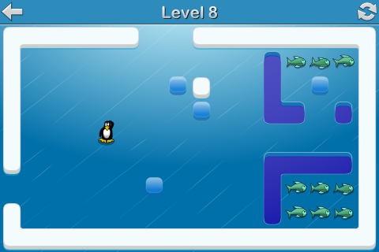

## Slippy

Slippy is a iOS puzzle game featuring the hungry non-swimmer penguin Slippy that
needs your help to catch fish. It is available for free in the app store, just search for "slippy" on a iOS device or visit the [Slippy app store page](https://itunes.apple.com/us/app/slippy-full-version/id408254506) for more information and screenshots etc.

It was my first experience with iOS and Objective-C so it should probably not
be consider a source of good practices :)

For convenience there is a
[page showing all the SVG files](http://wader.github.com/slippy/resources/svg/all.md).

## Building

First generate all image resources from the SVG files. You do this by installing
[inkmake](https://github.com/wader/inkmake) and then run `inkmake` in the
`resources/svg` directory. Now open the Xcode project and build.

Note that `Resources.m` and `Resources.h` are generated using [rgen](https://github.com/wader/rgen).

## Copyright

Slippy iOS source code and Google app engine backend source code is Copyright © 2010-2013 Mattias Wadman and licensed under MIT license.

SVG files are Copyright © 2010-2013 Mattias Wadman and licensed under [Creative commons Attribution-ShareAlike ](http://creativecommons.org/licenses/by-sa/3.0/).

All sound files except `menumusic.mp3` are based sounds from [freesound.org](http://freesound.org) and are licensed under [Creative commons Public Domain Dedication](http://creativecommons.org/publicdomain/zero/1.0/).

`menumusic.mp3` is Copyright © 2010-2013 Markus Kristo and licensed under [Creative commons Attribution-NonCommercial-NoDerivs](http://creativecommons.org/licenses/by-nc-nd/3.0/).

Original Slippy levels are Copyright © 1999 Martin Hock. If you want to use the levels
yourself you should probably contact Martin for permission.
